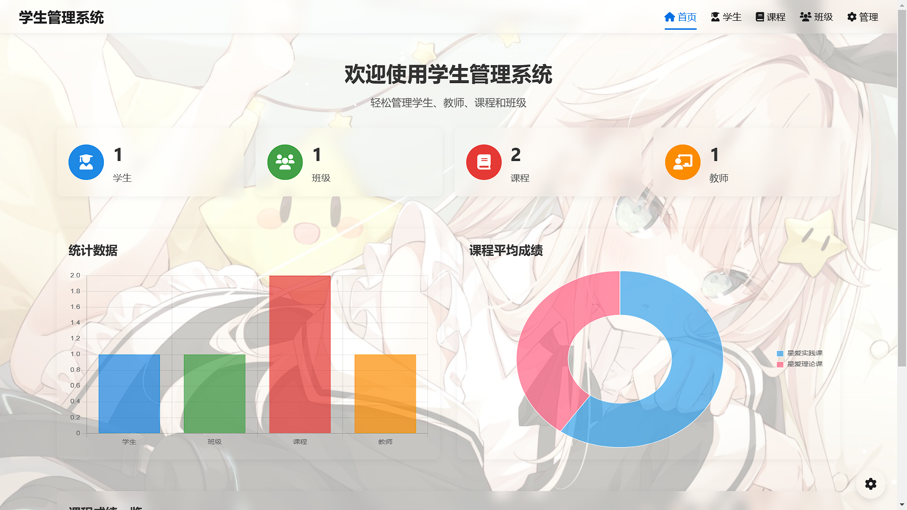

# 学生管理系统

一个使用Django框架开发，采用苹果风格UI的学生管理系统，支持学生、教师、课程和班级的管理。



## 功能特性

- **首页**：欢迎页展示系统概况，包括学生、教师、课程和班级的数量统计，以及课程平均成绩
- **学生管理**：查看学生列表，支持按姓名、学号、班级等进行搜索和筛选
- **课程管理**：查看课程列表及详情，管理选课学生
- **班级管理**：查看班级列表及成员，管理班级学生的课程信息
- **用户界面**：采用亚克力风格设计，界面简洁直观，支持响应式布局
- **高级功能**：
  - 支持背景图片自定义及透明度调节
  - 亚克力（毛玻璃）效果组件
  - 夜间模式支持
  - 拖放排序功能

## 技术栈

- **后端**：Django 5.1.7
- **前端**：原生HTML/CSS/JavaScript，亚克力风格设计
- **包管理**：uv
- **数据库**：SQLite (开发)

## 安装指南

### 环境要求

- Python 3.12+
- uv 包管理器

### 安装步骤

1. 克隆仓库到本地：

```bash
git clone https://github.com/your-username/student-manage.git
cd student-manage
```

2. 使用uv创建虚拟环境：

```bash
uv venv .venv
```

3. 激活虚拟环境：

```bash
# Windows
.venv\Scripts\activate

# Linux/Mac
source .venv/bin/activate
```

4. 安装依赖：

```bash
uv sync
```

5. 运行数据库迁移：

```bash
python manage.py migrate
```

6. 创建超级用户：

```bash
python manage.py createsuperuser # 测试数据库中默认有超级用户 username:admin. password:123456
```

7. 启动开发服务器：

```bash
python manage.py runserver
```

8. 访问系统：
   - 前台: http://127.0.0.1:8000/
   - 管理后台: http://127.0.0.1:8000/admin/

## 测试

运行测试：

```bash
python manage.py test
```

## 部署指南

详细的部署指南请参考 Django 官方文档：https://docs.djangoproject.com/en/5.1/howto/deployment/

## 许可证

本项目采用 MIT 许可证，详情请查看 LICENSE 文件。
